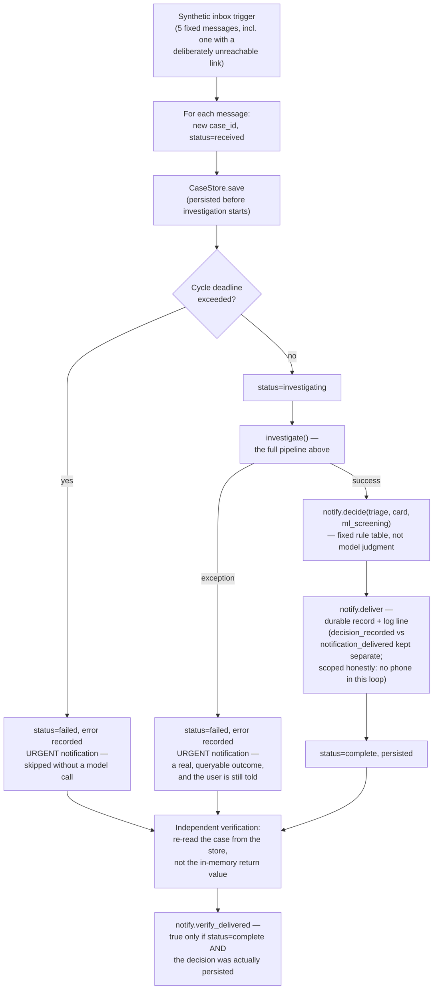

# Architecture

## Why four agents, not one

A single agent with every tool available is the easy version of this system
and the wrong one. The split below exists because each stage needs a
different, incompatible set of permissions and incentives:

| Stage | Model | Tools | Why this shape |
|---|---|---|---|
| Triage | cheap | none | Runs on every message. Must be fast and must not be able to justify its own escalation by "checking" anything first. |
| Claim extraction | reasoning | none | Turns free text into checkable propositions before any research starts, so the investigator has a fixed target rather than an open-ended brief. |
| Investigation | reasoning | `set_official_domain`, `fetch_official_page`, `compare_hostname_to_domain`, `report_fetch_ledger` | The only stage with network access, and every tool it holds is deterministic in what it's *allowed* to do — the model decides *which organization*, code decides *what domain that resolves to* (via the registry) and *what's permitted* against it. |
| Synthesis | reasoning | none | Produces the card the user reads. No tools, on purpose: it cannot quietly fetch one more page to justify a conclusion it already reached. |

A deterministic code layer (`_enforce_citations`) sits after synthesis and
trusts none of the four stages above it — see [README's "Design decisions
worth knowing about"](README.md#design-decisions-worth-knowing-about) for
what it actually checks, including how a downgraded verdict pulls
`risk_level`, `headline`, and `inferences` down with it rather than leaving
them stale.

## Message analysis pipeline

```mermaid
flowchart TD
    subgraph Boundary["app.py — HTTP boundary"]
        A["POST /invocations<br/>{\"text\": \"...\"}"] --> B{"InvocationRequest<br/>validation"}
        B -->|invalid: not a plain<br/>non-empty string| C["HTTPException(422)<br/>clean JSON, real status code"]
    end

    B -->|valid string only| D["Triage Agent<br/>(cheap model, no tools)"]
    D -->|"warrants_investigation:<br/>false (the common case)"| E0["ml_screen.py: classical<br/>TF-IDF + SVM classifier<br/>(nothing named to verify,<br/>so a different kind of check)"]
    E0 -->|not flagged| E["Silent.<br/>No card, no alert."]
    E0 -->|flagged| E1["NotificationChannel.ADVISORY<br/>— a probability, never a verdict"]
    D -->|true| F["Claim Extraction Agent<br/>(no tools)"]

    F --> G["Investigator Agent<br/>(only stage with tools)"]

    subgraph Tools["tools/evidence.py"]
        H["set_official_domain(org)<br/>(must be called first;<br/>domain is looked up in registry.py,<br/>never supplied by the model;<br/>locks once per case)"]
        I["fetch_official_page<br/>(refuses any URL off the<br/>locked domain, before any request)"]
        J["compare_hostname_to_domain<br/>(checks locked domain only)"]
    end

    G --> H --> I
    H --> J
    I -->|"SSRF-guarded fetch:<br/>peer-IP validated post-connect,<br/>not just DNS-checked"| K["safety.py: safe_fetch"]

    G --> L["Synthesis Agent<br/>(no tools — cannot fetch to<br/>justify its own conclusion)"]
    K -.->|"real retrieved text,<br/>not the investigator's<br/>paraphrase of it"| L

    L --> M["_enforce_citations<br/>(deterministic, trusts nothing above)"]
    M --> N{"Per evidence item:<br/>ID fetched? URL matches?<br/>status &lt; 400? quote verbatim<br/>in real text?"}
    N -->|any check fails| O["Item dropped.<br/>Verdict downgraded if it<br/>depended on dropped evidence."]
    N -->|all pass| P["is_first_party / source_controller<br/>overwritten from the domain lock<br/>(never taken from the model)"]

    P --> Q["EvidenceCard returned"]
    O --> Q
```

## End-to-end action: `{"action": "run_inbox_cycle"}`

The single-message flow above returns a card to whoever called it — useful,
but not itself a completed action. This is the vertical slice that actually
does something end to end, wired as a real capability of the deployed agent
rather than a side script.



## Data contracts

The full verdict taxonomy, why "no verdict means safe" is enforced as a
schema invariant rather than a convention, and every field's role in the
evidence card live in [`schemas.py`](smishsentinel/schemas.py) — read there
rather than duplicated here, since the code is the source of truth and this
document would drift from it otherwise.
